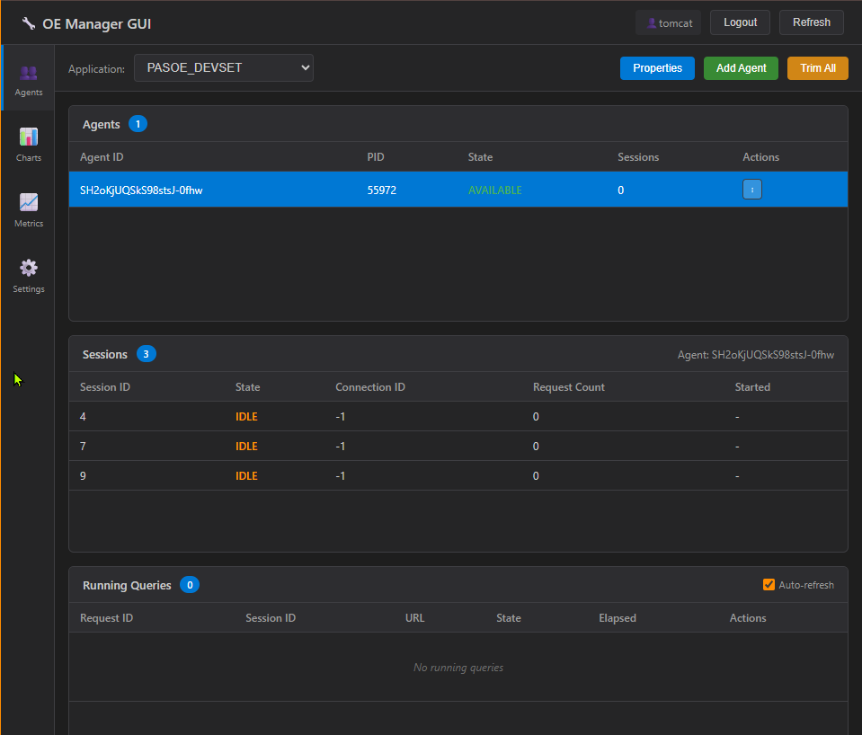
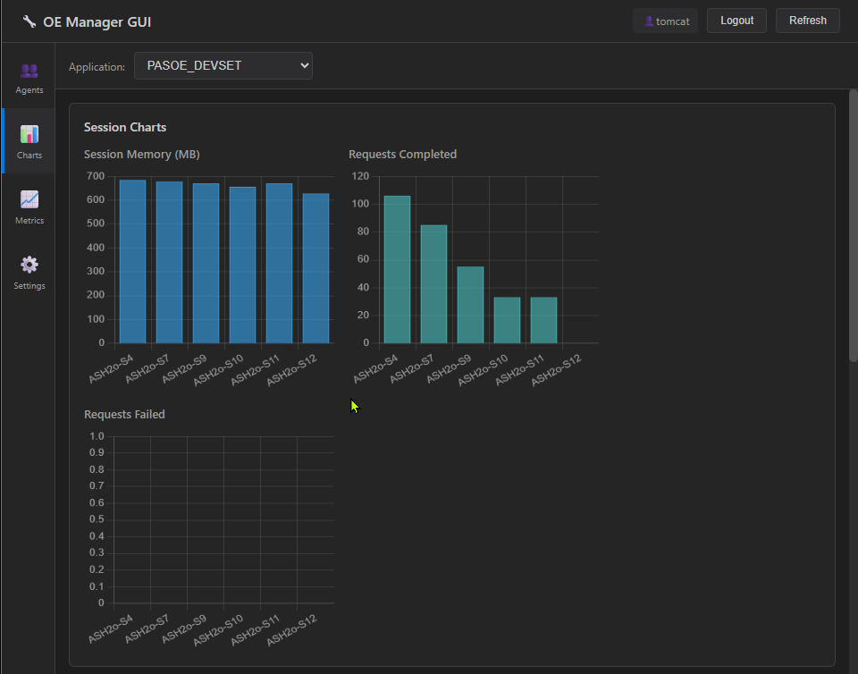
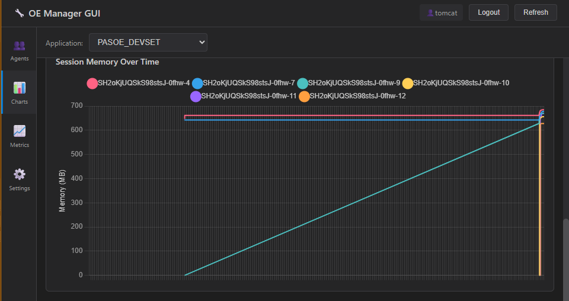
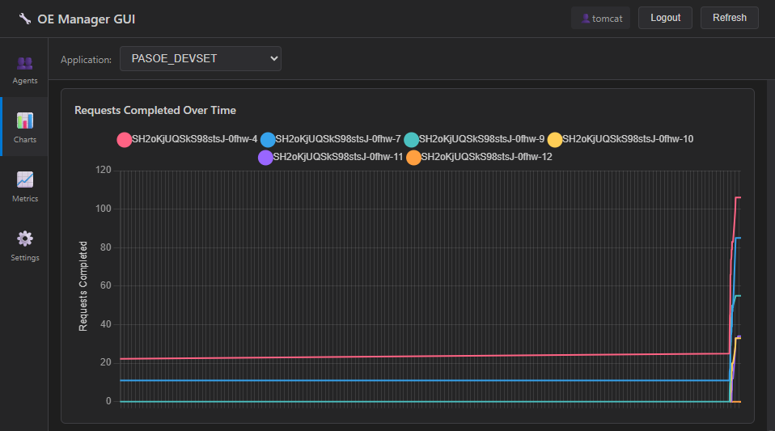
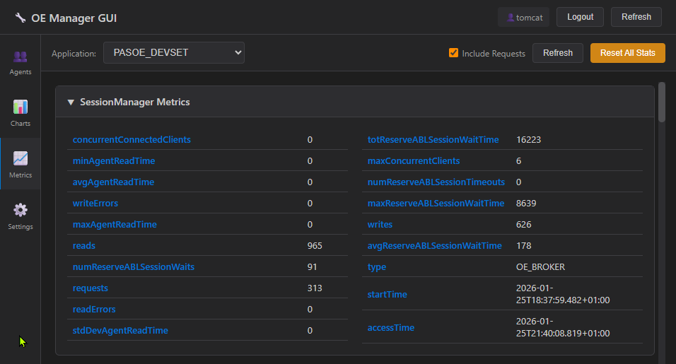
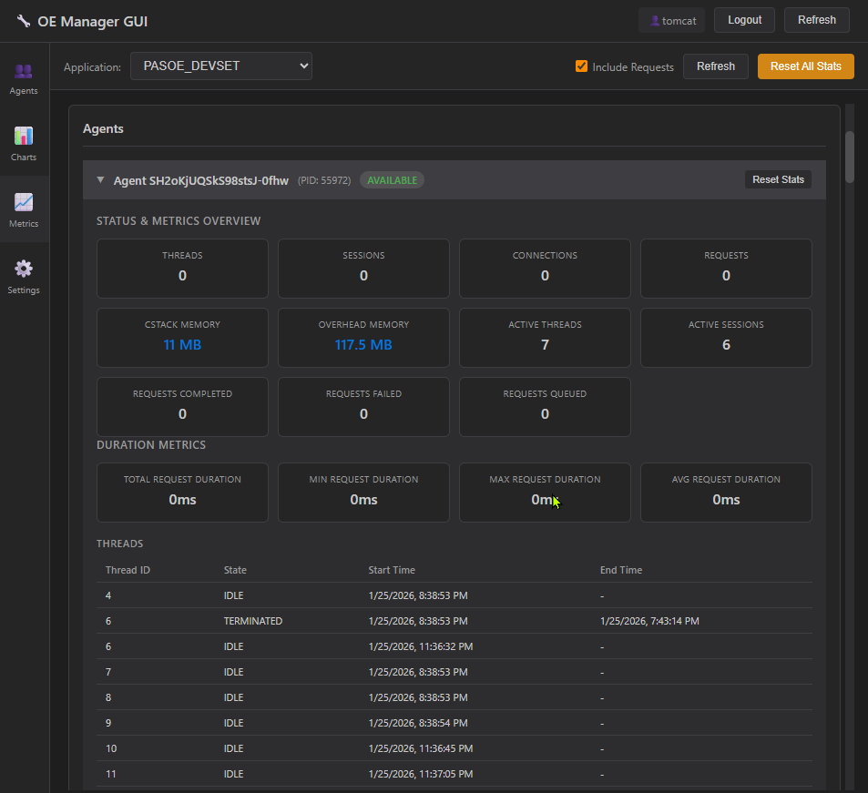
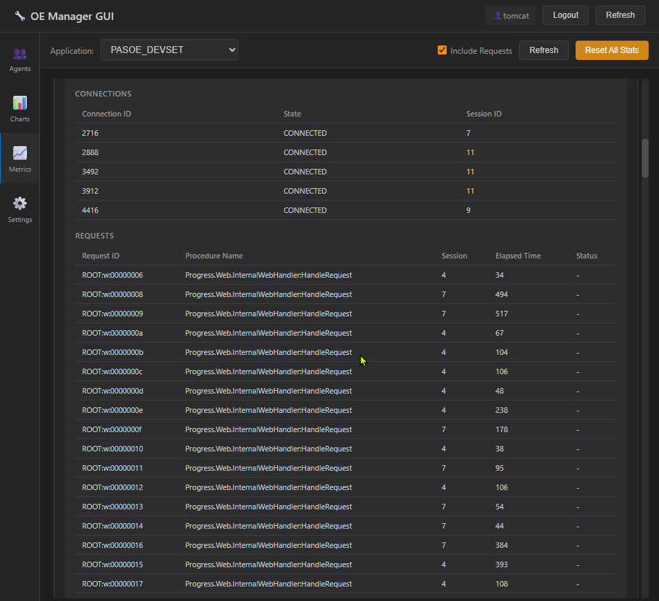
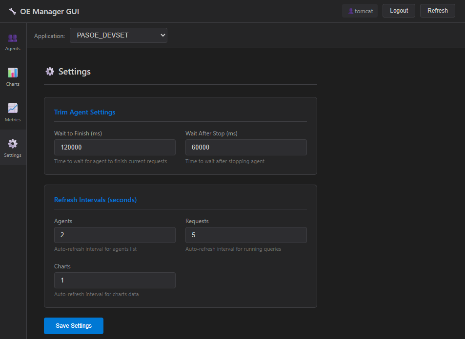

# OE Manager GUI

Web-based management interface for OpenEdge PASOE agents and sessions. This is a static webapp port of the [VS Code OE Manager GUI extension](https://marketplace.visualstudio.com/items?itemName=diabolo-68.oemanagergui).

## Features

- **Agents View**: Monitor and manage PASOE agents with real-time session and request tracking
- **Charts View**: Visualize memory usage and request statistics over time
- **Metrics View**: Display SessionManager metrics and per-agent statistics
- **Settings View**: Configure trim agent settings and refresh intervals

### Agent Management


- View all agents and their states (Available, Busy, Locked)
- Add new agents to the pool
- Delete agents (graceful shutdown)
- Trim idle sessions from agents
- Enable/Disable ABL Objects tracking
- View ABL Objects Report
- Cancel running requests

### Charts







- Memory usage over time (heap memory)
- Request statistics (completed vs failed)
- Auto-refresh with configurable intervals
- Historical data visualization

### Metrics







- SessionManager metrics (sessions, requests, memory)
- Per-agent metrics with reset capability
- Real-time updates

## Requirements

- OpenEdge PASOE 11.7 or later

## Installation

### Option 1: Build from Source

1. Clone this repository
2. Build with Maven:
   ```powershell
   mvn clean package
   ```
3. Deploy `target/oemanagergui.war` to Pasoe

### Option 2: Download WAR

Download the latest `oemanagergui.war` from releases and deploy to Pasoe.

## Deployment

### Tomcat Standalone

Copy the WAR file to Tomcat's webapps directory:

```powershell
Copy-Item target/oemanagergui.war $env:CATALINA_HOME/webapps/
```

Access at: `http(s)://<base_url>/oemanagergui/`

### PASOE Instance

Deploy alongside PASOE by copying to its webapps:


## Configuration

On first launch, you'll be prompted to log in:

### Login

| Field | Description |
|-------|-------------|
| Username | OE Manager username |
| Password | OE Manager password (not stored - re-enter each session) |

**Note**: The Base URL is automatically derived from the webapp location. Deploy on the same PASOE instance as the oemanager API.

### Settings

Click the **Settings** tab in the sidebar to configure:



| Setting | Description | Default |
|---------|-------------|--------|
| Wait to Finish | Time to wait for agent to finish requests (ms) | 120000 |
| Wait After Stop | Time to wait after stopping agent (ms) | 60000 |
| Agents Refresh | Auto-refresh interval for agents list (seconds) | 10 |
| Requests Refresh | Auto-refresh interval for requests (seconds) | 5 |
| Charts Refresh | Auto-refresh interval for charts (seconds) | 10 |

## Usage

### Connecting

1. Open the webapp - the Login modal appears automatically
2. Enter your OE Manager credentials
3. Click **Login**
4. The application dropdown will populate with available applications
5. Select an application to start managing agents
6. Click **Logout** in the header to disconnect

### Agent Actions

Right-click on an agent row to access the context menu:

- **Add Agent** - Add a new agent to the pool
- **Delete Agent** - Remove the agent (graceful shutdown)
- **Trim Sessions** - Close idle sessions on this agent
- **Enable ABL Objects** - Start tracking ABL object usage
- **Disable ABL Objects** - Stop tracking ABL objects
- **ABL Objects Report** - View current ABL objects report
- **Reset Statistics** - Reset agent statistics counters

### Views

Switch between views using the sidebar:

- **Agents** - Agent/Session/Request management
- **Charts** - Memory and request charts
- **Metrics** - SessionManager and agent metrics
- **Settings** - Configure refresh intervals and trim settings

## Architecture

```
Browser (HTML/CSS/JS) → PASOE oemanager REST API
```

This is a pure static webapp with no backend server. All API calls go directly to PASOE's oemanager REST API using the Fetch API with Basic Authentication.

### File Structure

```
oemanagergui/
├── index.html              # Main HTML with all views and templates
├── css/
│   └── style.css           # Dark theme styles
├── js/
│   ├── agentService.js     # API wrapper for oemanager REST API
│   ├── app.js              # Main application class
│   ├── agentsView.js       # Agents view mixin
│   ├── chartsView.js       # Charts view mixin
│   ├── metricsView.js      # Metrics view mixin
│   ├── templates.js        # HTML templates helper
│   └── utils.js            # Utility functions
├── WEB-INF/
│   └── web.xml             # Webapp descriptor
├── pom.xml                 # Maven build configuration
├── CHANGELOG.md            # Version history
└── README.md
```

## API Endpoints Used

All endpoints follow pattern: `{baseUrl}/oemanager/applications/{app}/...`

| Endpoint | Method | Description |
|----------|--------|-------------|
| `/oemanager/applications` | GET | List applications |
| `/agents` | GET | List agents |
| `/agents/{id}/sessions` | GET | Agent sessions |
| `/agents/{id}/requests` | GET | Agent requests |
| `/agents/properties` | GET/PUT | Agent properties |
| `/metrics` | GET | SessionManager metrics |
| `/agents/{id}/metrics` | GET | Agent metrics |
| `/agents` | POST | Add agent |
| `/agents/{id}` | DELETE | Trim agent (graceful shutdown) |
| `/agents/{id}/sessions/{sid}?terminateOpt=2` | DELETE | Terminate session |
| `/agents/{id}/agentStatData` | DELETE | Reset statistics |
| `/agents/{id}/ABLObjects` | PUT | Enable/Disable ABL objects |
| `/agents/{id}/ABLObjectsReport` | GET | Get ABL objects report |
| `/requests/{id}/cancel` | PUT | Cancel request |

## Related Projects

- [VS Code OE Manager GUI](https://marketplace.visualstudio.com/items?itemName=diabolo-68.oemanagergui) - Original VS Code extension
- [OpenEdge Documentation](https://docs.progress.com/bundle/openedge-management) - PASOE management documentation

## License

MIT License - see [LICENSE](LICENSE) file.
