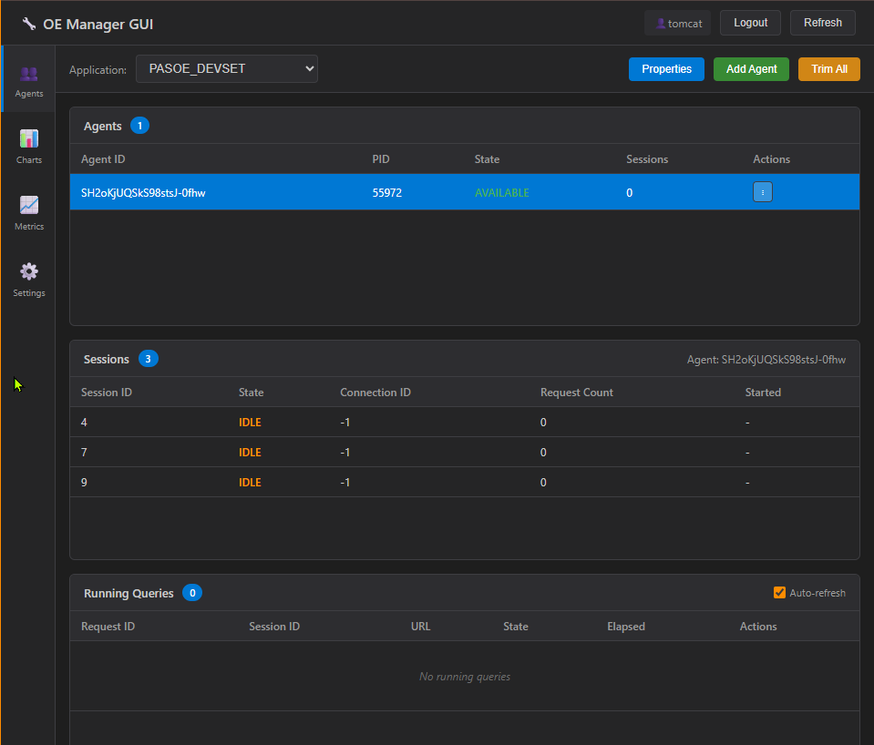
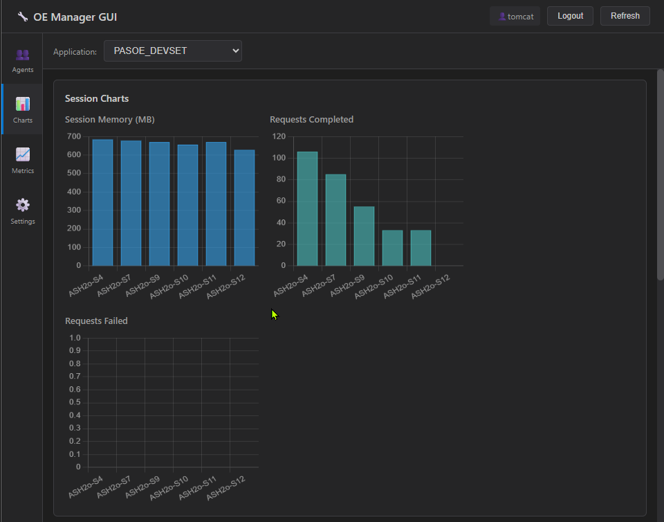
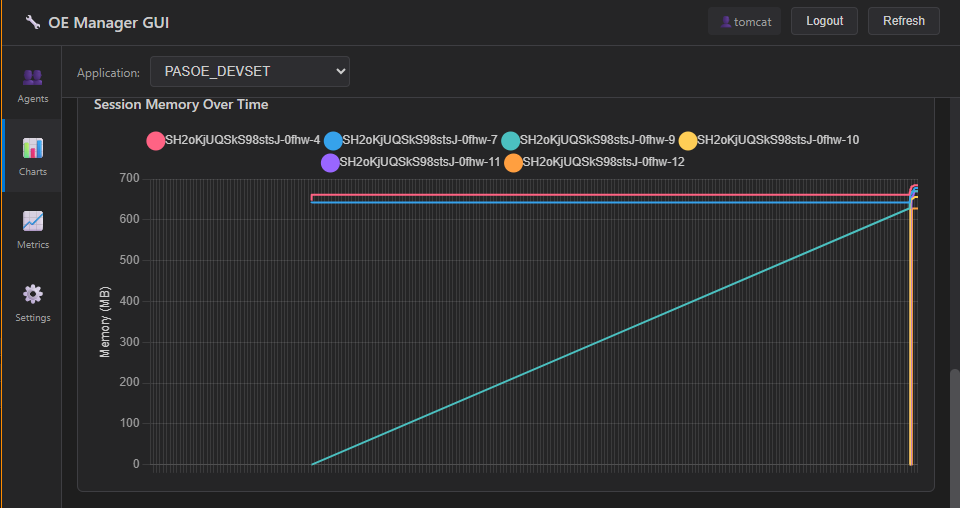
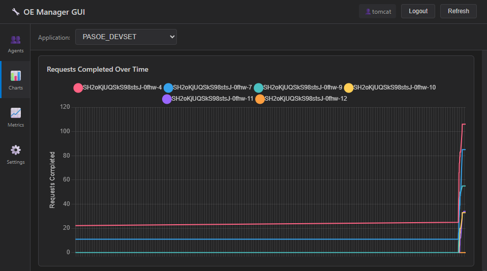
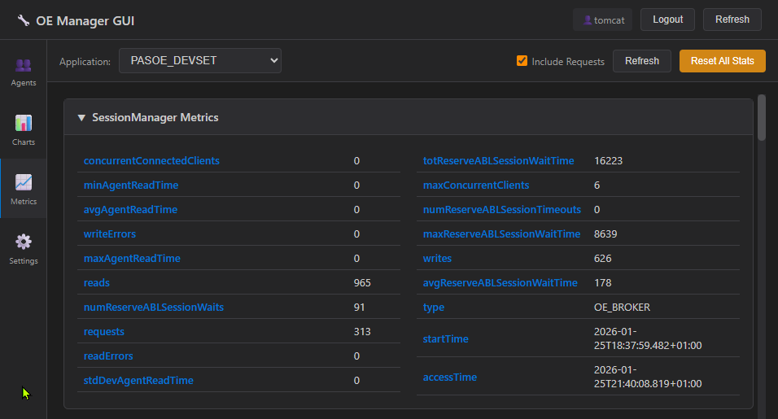
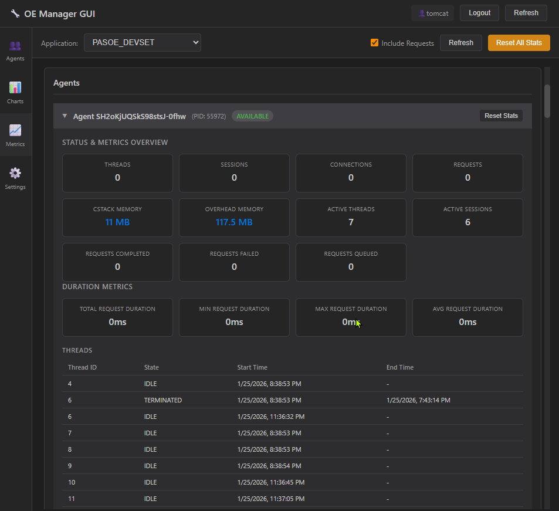
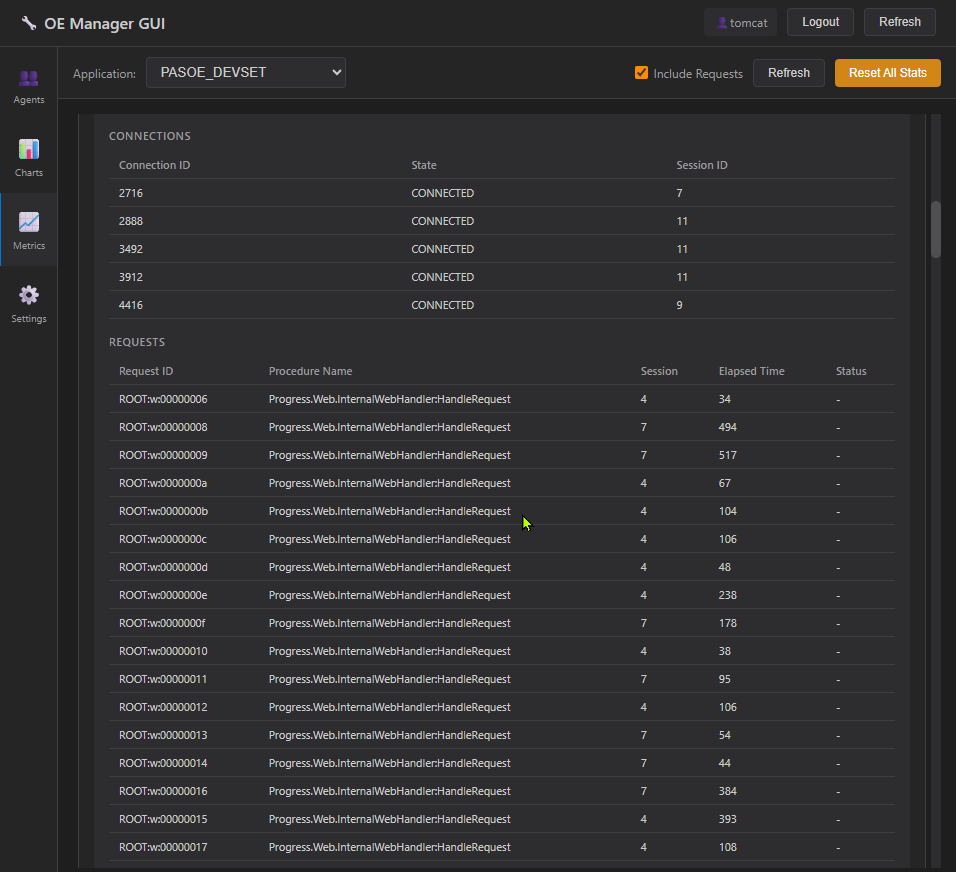
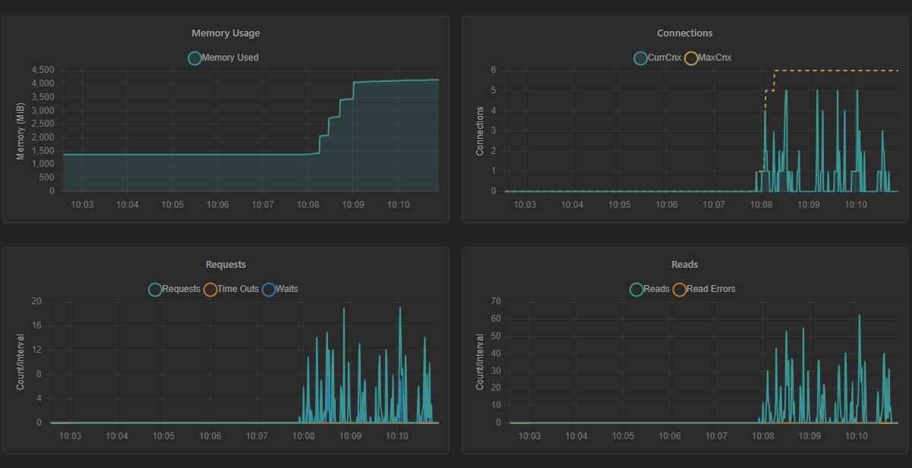
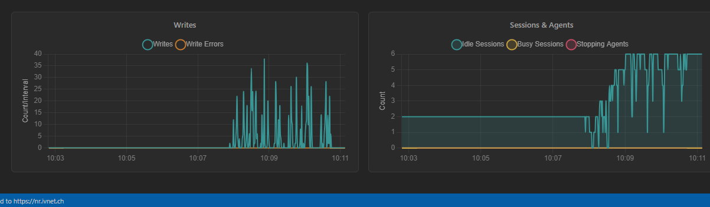
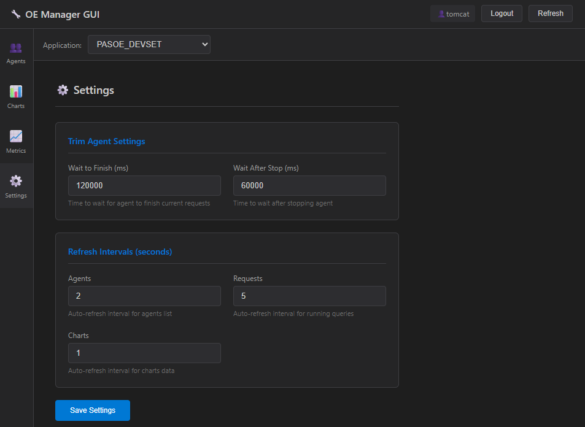

# OE Manager GUI

Web-based management interface for OpenEdge PASOE agents and sessions. This is a static webapp port of the [VS Code OE Manager GUI extension](https://marketplace.visualstudio.com/items?itemName=diabolo-68.oemanagergui).

## Features

- **Agents View**: Monitor and manage PASOE agents with real-time session and request tracking
- **Charts View**: Visualize memory usage and request statistics over time
- **Metrics View**: Condensed per-agent statistics table with combined thread, connection and request grids
- **PASOE Stats View**: Time-series charts for PASOE performance metrics (memory, connections, requests, reads/writes)
- **Logfiles View**: Tail-first, bounded-memory agent/access log browsing with backward and forward navigation
- **Lifecycles View**: Agent (PID) and ABL session lifecycles derived from the agent log, with request and session flame charts
- **Settings View**: Configure trim agent settings and refresh intervals

### Agent Management


- View all agents and their states (Available, Busy, Locked)
- Add new agents to the pool
- Delete agents (graceful shutdown)
- Trim idle sessions from agents
- Enable/Disable ABL Objects tracking
- View ABL Objects Report
- Cancel running requests

### Charts







- Memory usage over time (heap memory)
- Request statistics (completed vs failed)
- Optional legend per time-series chart: hover the legend icon to preview, click to pin
  - Grouped by agent (ID, PID, state, memory, threads, sessions, requests, durations) with every session's color, state, start time and current value
  - Click a session row to show or hide its line; each session keeps its color across refreshes
  - Sessions that left the 200-point window are removed from the chart and legend
- Auto-refresh with configurable intervals
- Historical data visualization

### Metrics







- SessionManager metrics (sessions, requests, memory)
- One summary row per agent (status, memory, active, exited, requests, request durations) with a per-agent Reset button
- Combined Threads, Connections and Requests grids covering all agents; Request IDs open the Logfiles view
- Auto-refresh (default 10s, `0` disables) with Pause/Resume and Refresh Now; rows update in place

### PASOE Stats





- Memory usage over time (MiB)
- Connections chart (Current vs Maximum)
- Requests, Timeouts, and Waits (delta values per interval)
- Reads and Read Errors (delta values per interval)
- Writes and Write Errors (delta values per interval)
- Sessions & Agents (Idle Sessions, Busy Sessions, Stopping Agents)
- Auto-refresh with configurable interval (default: 30 seconds)
- 2-column responsive layout

### Logfiles

- Opens at the newest complete log entries instead of reading the complete file
- Loads older or newer chunks on demand by scrolling or using navigation buttons
- Keeps at most three 256 KiB chunks per source in browser memory
- Follows appended entries without reloading historical content
- Handles log truncation and rotation by reopening the newest tail
- Applies filters and request correlation to the currently loaded window
- Filters: source, agent number, PID, ABL session (e.g. `AS-7`), type, client IP, status, min duration, request ID, free text

### Lifecycles

- Shows agent (PID) and ABL session lifecycles for one day, in an expandable **Tree** or **Packed lanes** mode
- **Min sessions** (default 4) hides agents with fewer sessions
- Drag or Ctrl+wheel to zoom; all charts share one time window
- Click a bar to open the Logfiles view filtered by PID, session or request ID (filters cover the loaded window; use **Older** for earlier entries)
- Optional **Flame Chart** of all HTTP requests of the day, colored by status (loaded only while shown); a warning appears above the *Flame Chart Warning Threshold* setting
- Optional **Session Flame** chart with one bar per session, colored by agent, red outline for sessions with errors
- The day's logs are streamed in 2 MiB chunks and only compact aggregates are kept in browser memory

## Requirements

- OpenEdge PASOE 11.7 or later

## Installation

### Option 1: Build from Source

1. Clone this repository
2. Build with Maven:
   ```powershell
   mvn clean package
   ```
3. Deploy `target/oemanagergui.war` to Pasoe

### Option 2: Download WAR

Download the latest `oemanagergui.war` from releases and deploy to Pasoe.

## Deployment

### Tomcat Standalone

Copy the WAR file to Tomcat's webapps directory:

```powershell
Copy-Item target/oemanagergui.war $env:CATALINA_HOME/webapps/
```

Access at: `http(s)://<base_url>/oemanagergui/`

### PASOE Instance

Deploy alongside PASOE by copying to its webapps:


## Configuration

On first launch, you'll be prompted to log in:

### Login

| Field | Description |
|-------|-------------|
| Username | OE Manager username |
| Password | OE Manager password (not stored - re-enter each session) |

**Note**: The Base URL is automatically derived from the webapp location. Deploy on the same PASOE instance as the oemanager API.

### Settings

Click the **Settings** tab in the sidebar to configure:



| Setting | Description | Default |
|---------|-------------|--------|
| Wait to Finish | Time to wait for agent to finish requests (ms) | 120000 |
| Wait After Stop | Time to wait after stopping agent (ms) | 60000 |
| Agents Refresh | Auto-refresh interval for agents list (seconds) | 10 |
| Requests Refresh | Auto-refresh interval for requests (seconds) | 5 |
| Charts Refresh | Auto-refresh interval for charts (seconds) | 10 |
| PASOE Stats Refresh | Auto-refresh interval for PASOE stats (seconds) | 30 |
| Log Files Refresh | Auto-refresh interval for log auto-load and Lifecycles (seconds) | 5 |
| Agent Metrics Refresh | Auto-refresh interval for agent metrics (seconds, `0` disables) | 10 |
| Flame Chart Warning Threshold | Warn when a day has more requests than this (`0` disables) | 20000 |

## Usage

### Connecting

1. Open the webapp - the Login modal appears automatically
2. Enter your OE Manager credentials
3. Click **Login**
4. The application dropdown will populate with available applications
5. Select an application to start managing agents
6. Click **Logout** in the header to disconnect

### Agent Actions

Right-click on an agent row to access the context menu:

- **Add Agent** - Add a new agent to the pool
- **Delete Agent** - Remove the agent (graceful shutdown)
- **Trim Sessions** - Close idle sessions on this agent
- **Enable ABL Objects** - Start tracking ABL object usage
- **Disable ABL Objects** - Stop tracking ABL objects
- **ABL Objects Report** - View current ABL objects report
- **Reset Statistics** - Reset agent statistics counters

### Views

Switch between views using the sidebar:

- **Agents** - Agent/Session/Request management
- **Charts** - Memory and request charts
- **Metrics** - SessionManager and agent metrics
- **PASOE Stats** - Performance metrics over time (memory, connections, requests, I/O)
- **Logfiles** - Bounded tail browsing with older/newer navigation
- **Lifecycles** - Agent and ABL session lifecycles with flame charts
- **Settings** - Configure refresh intervals and trim settings

## Architecture

```
Browser (HTML/CSS/JS) → PASOE oemanager REST API
```

Most API calls go directly to PASOE's oemanager REST API using the Fetch API with Basic Authentication.
A small same-origin servlet provides restricted, bounded file reads inside the PASOE instance directory for the
logfiles view.

### File Structure

```
oemanagergui/
├── index.html              # Main HTML with all views and templates
├── css/
│   └── style.css           # Dark theme styles
├── js/
│   ├── agentService.js     # API wrapper for oemanager REST API
│   ├── app.js              # Main application class
│   ├── agentsView.js       # Agents view mixin
│   ├── chartsView.js       # Charts view mixin
│   ├── metricsView.js      # Metrics view mixin
│   ├── logFileService.js   # Log parsing, filtering and lifecycle aggregation
│   ├── logfilesView.js     # Logfiles view mixin
│   ├── laneCanvasChart.js  # Canvas lane (flame) chart used by Lifecycles
│   ├── lifecyclesView.js   # Lifecycles view mixin
│   ├── templates.js        # HTML templates helper
│   └── utils.js            # Utility functions
├── WEB-INF/
│   └── web.xml             # Webapp descriptor
├── pom.xml                 # Maven build configuration
├── CHANGELOG.md            # Version history
└── README.md
```

## API Endpoints Used

All endpoints follow pattern: `{baseUrl}/oemanager/applications/{app}/...`

| Endpoint | Method | Description |
|----------|--------|-------------|
| `/oemanager/applications` | GET | List applications |
| `/agents` | GET | List agents |
| `/agents/{id}/sessions` | GET | Agent sessions |
| `/agents/{id}/requests` | GET | Agent requests |
| `/agents/properties` | GET/PUT | Agent properties |
| `/metrics` | GET | SessionManager metrics |
| `/agents/{id}/metrics` | GET | Agent metrics |
| `/agents` | POST | Add agent |
| `/agents/{id}` | DELETE | Trim agent (graceful shutdown) |
| `/agents/{id}/sessions/{sid}?terminateOpt=2` | DELETE | Terminate session |
| `/agents/{id}/agentStatData` | DELETE | Reset statistics |
| `/agents/{id}/ABLObjects` | PUT | Enable/Disable ABL objects |
| `/agents/{id}/ABLObjectsReport` | GET | Get ABL objects report |
| `/requests/{id}/cancel` | PUT | Cancel request |

## Related Projects

- [VS Code OE Manager GUI](https://marketplace.visualstudio.com/items?itemName=diabolo-68.oemanagergui) - Original VS Code extension
- [OpenEdge Documentation](https://docs.progress.com/bundle/openedge-management) - PASOE management documentation

## License

MIT License - see [LICENSE](LICENSE) file.
